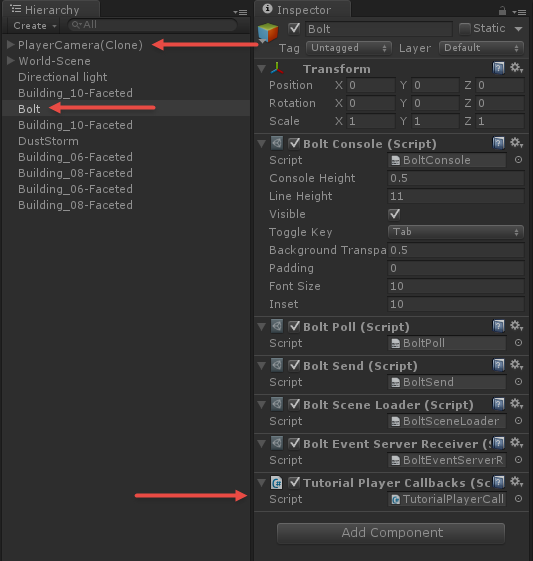
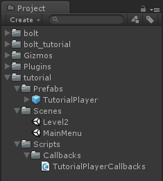
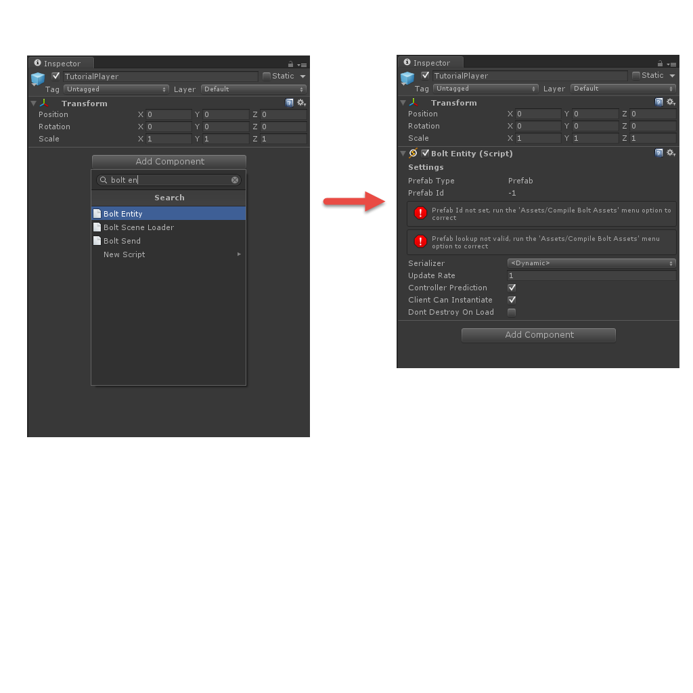
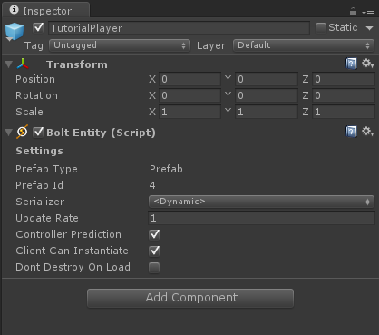
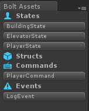
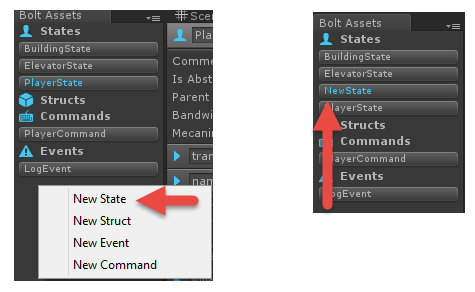
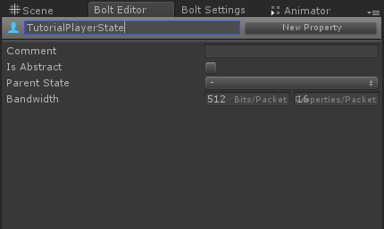
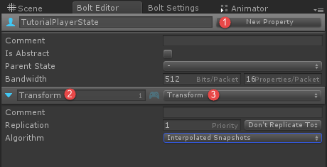
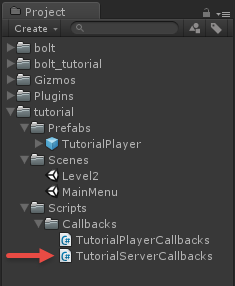
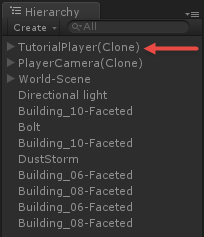

[<< Prev Chapter](chapter1.md)

# Chapter 2

Bolt deals with replication in a completely different way compared to most (all?) other networking solutions for Unity. Instead of manually writing code for serializing data, for example using **OnSerializeNetworkView** in the built in Unity networking solution, Bolt lets you define transforms, animations and custom properties for it to automatically replicate over the network - you don't need to write any code whatsoever. In fact in this entire tutorial we do not write any type of low level networking code, Bolt handles all of it for you.

## Adding a camera

The first thing we are going to do is set up a camera so that we can see what's going on, but instead of just dropping a camera into the scene we will go through Bolt and hook into some of it's callbacks. The finished tutorial comes with an already functioning camera which has all the features we need, and since this tutorial is not about building a third person camera, we are just going to use it verbatim.

You will find the camera prefab in *bolt_tutorial/prefabs/singletons/resources/PlayerCamera* and its associated script is available in *bolt_tutorial/scripts/player/PlayerCamera.cs*. The camera script inherits from a utility base class defined inside bolt called BoltSingletonPrefab\<T\>, it is used to automatically load a prefab from a *Resources*.

Time to create our first script, in our own tutorial folder create a script called *TutorialPlayerCallbacks.cs* in the folder *tutorial/Scripts/Callbacks*. 

* Have the class inherit from `Bolt.GlobalEventListener`
* Apply the `[BoltGlobalBehaviour]` to the class
* Override the `SceneLoadLocalDone` method that is inherited from `Bolt.GlobalEventListener`
* Inside the `SceneLoadLocalDone` override the call `PlayerCamera.Instantiate()` (yes, without any arguments)
* It is very important that you **do not** attach this behavior to any game object in any of your scenes

```csharp
using UnityEngine;

[BoltGlobalBehaviour("Level2")]
public class TutorialPlayerCallbacks : Bolt.GlobalEventListener {
  public override void SceneLoadLocalDone(string map) {
	// this just instantiates our player camera, 
	// the Instantiate() method is supplied by the BoltSingletonPrefab<T> class
    PlayerCamera.Instantiate();
  }
}
```


Before we start our game it is probably a good idea to explain exactly what is going on here. What does the `[BoltGlobalBehaviour("Level2")]` actually do? When Bolt starts, it will find *all* classes which have the `[BoltGlobalBehaviour("Level2")]` and in some way or another inherit from `MonoBehaviour` (Since `Bolt.GlobalEventListener` itself inherits from `MonoBehaviour` our own class `TutorialPlayerCallbacks` is also considered as inheriting from `MonoBehaviour`). 

Bolt will then go through the classes it found matching these two conditions and create instances of them automatically for you, so that they exist when Bolt is running and are destroyed when Bolt is shut down. Any instances which are created will be added to the 'Bolt' game object which is automatically created by Bolt on start, and you can clearly see it in your scene hierarchy.

There are a couple of ways to configure how `[BoltGlobalBehaviour("Level2")]` will act, the first and most simple one is that you can decide if the behaviour in question should run on either the server or client, or both. Specifying nothing like we did for our `TutorialPlayerCallbacks` class means it will run on both the server and client.

```csharp
// only on the server
[BoltGlobalBehaviour(BoltNetworkModes.Server)]

// only on the client
[BoltGlobalBehaviour(BoltNetworkModes.Client)]
```

You can also tell Bolt that a behaviour should only be available during specific scenes, for example our scene is called *Level2*.

```csharp
// only when the current scene is 'Level2'
[BoltGlobalBehaviour("Level2")]

// only when the current scene is 'Level1', 'Level2' or 'Level3' 
[BoltGlobalBehaviour("Level1", "Level2", "Level3")]
```

You can also combine these.

```csharp
// only when we are the server AND the current scene is 'Level2'
[BoltGlobalBehaviour(BoltNetworkModes.Server, "Level2")]

// only when we are the client AND the current scene is 'Level2'
[BoltGlobalBehaviour(BoltNetworkModes.Client, "Level2")]
```

This is an integral part of Bolt as it allows you to easily define behaviour that is global to the entire application or an entire scene, without having to manually fiddle around with passing a game object marked with `DontDestroyOnLoad` around through all of your scenes. Like we mentioned before it is **paramount** that you do not under any circumstance manually attach these scripts to an object in your scene, Bolt will handle this for you automatically.

## Starting with our camera

Open the *Window/Bolt Scenes* window and click *Play As Server* on the *Level2* scene. You should now see the server starting in the *Game* window and our camera instantiate. 


If you look in the scene hierarchy you will see a game object called *Bolt*, this is bolts internal object and we went the route of making it completely visible (no HideFlags) so that you know what's going on at all times. If you check the inspector for this object you will see all of the internal behaviours that Bolt automatically instantiates, and also your `TutorialPlayerCallbacks` behaviour at the bottom. You will also see the PlayerCamera which was instantiated in the `SceneLoadLocalDone` callback.



## Creating our prefab

Start by creating a new empty game object and call it *TutorialPlayer*, make sure that it is positioned at (0, 0, 0) with rotation (0, 0, 0) and scale (1, 1, 1). The model we are going to use you can find in *bolt_tutorial/art/models/sgtBolt* and the prefab is called *sgtBolt4Merged-ModelOnly*, drag an instance of this prefab into the hierarchy. Make sure the sgtBolt prefab has the same position, rotation and scale values as the *TutorialPlayer* game object. Now drag the *sgtBolt4Merged-ModelOnly* object as a child to your *TutorialPlayer* object.


Create a new folder called *Prefabs* in your tutorial folder and drag your *TutorialPlayer* object into this folder to create a prefab out of it. You can now delete the *TutorialPlayer* object in the scene hierarchy.



Select the *TutorialPlayer* prefab and add a *Bolt Entity* component to it. 




A *Bolt Entity* component is loosely related to a *Network View* in Unity or Photon, but it also serves a couple of additional purposes in Bolt. The first thing we want to do is correct the two errors, this is simply done by going to the *Assets/Compile Bolt Assets* menu option at the top menu bar.  

When running *Assets/Compile Bolt Assets* Bolt will go through all of your prefabs and other Bolt-related assets and compile a very efficient network protocol for them, which is then stored inside of the *bolt.user.dll* assembly which you can find in *bolt/assemblies*. Running the *Assets/Compile Bolt Assets* command is done for several things in Bolt, but we will cover all of them in this tutorial.

After you ran compile, the *Bolt Entity* component on your prefab should now look like this. As you can see there is still a warning here which we will get that to go away in just a minute.



## State in Bolt

Before we get into the details, let's define what *"state"* in Bolt actually is. State is the transform, animation and data of your game object. Bolt will **automatically** replicate any state that you assign to your entities over the network, including transform and animations (mecanim only, no legacy support).

Compared to most other networking solutions for Unity, Bolt takes a vastly different approach to sending data over the network. Instead of manually writing serialize-, deserialize- and interpolation-code Bolt lets you define data and interactions in a very convenient interface from inside the Unity Editor. *We are adding a DSL (Domain Specific Language) in the future which lets you define the same things in text*.

There are two editor windows available in Bolt which deals with the definition of networking assets, they are found under *Window/Bolt Engine/Assets* and *Window/Bolt Engine/Editor*. If we open up the *Window/Bolt Engine/Assets* window you will see a list of the existing assets that comes with the finished tutorial project.




We are going to start by creating our a state for our TutorialPlayer prefab, right-click anywhere in the *Bolt Assets* window and select *New State*. You can also click on the little icon next to the **States** header.



If Bolt did not automatically open it's editor window you can click on the newly created state *NewState* to open it. Name our state *TutorialPlayerState*.  



For now we are going leave all of the state-specific settings as they are, but we need to create a property for our transform to be replicated. Click 'New Property' in the top left next to the state name we just changed. Name the property 'Transform' and also select the type as 'Transform'. 



The other available settings on the Transform should be left at their defaults. They allow configuration of more complex parts of Bolt such as prioritization of properties and smoothing algorithms. **Run Assets/Bolt Compile Assets (All)** again.

If you select the *TutorialPlayer* prefab again and on it's *Bolt Entity* script under *Serializer* select the now available serializer called *ITutorialPlayerState*.

## Scene loading callbacks 

We have one more thing to do before we can spawn a character for our game; we need to hook into a callback on the server to instantiate our prefab for both the server and clients.

Create a new script called `TutorialServerCallbacks` under the *tutorial/Scripts/Callbacks* folder. 



```csharp
using UnityEngine;

[BoltGlobalBehaviour(BoltNetworkModes.Server, "Level2")]
public class TutorialServerCallbacks : Bolt.GlobalEventListener {
  public override void SceneLoadLocalDone(string map) {
    BoltNetwork.Instantiate(BoltPrefabs.TutorialPlayer);
  }

  public override void SceneLoadRemoteDone(BoltConnection connection) {
    BoltNetwork.Instantiate(BoltPrefabs.TutorialPlayer);
  }
}
```

Our `TutorialServerCallbacks` class should inherit from `Bolt.GlobalEventListener`; we should also decorate the class with a `BoltGlobalBehaviour` which has the option for only running on the server and only our *Level2* scene.

We are also overriding two callbacks that have to do with scene loading, the first one called  `SceneLoadLocalDone` will be invoked when the local computer is done loading the scene and since this behaviour is marked as to only run on the server it will only be active on the server.

`SceneLoadRemoteDone` will be called when the remote end on the connection that is being passed in has loaded the scene, since again we are only running this behaviour on the server this lets us tell when a client is done loading the current scene.

In both methods we simply instantiate a copy of our TutorialPlayer prefab. Notice that the class `BoltPrefabs` contains a field for each of your bolt entity prefabs, so you always have easy access to all of them.

Start an instance of the server by pressing the *Play As Server* button in the *Bolt Scenes* window. Not a lot will differ from the previous time we started our scene, but if you look in the hierarchy you will see an instance of our *TutorialPlayer* prefab. 



You can also build and launch a separate client which connects to the server; you will see that you get two *TutorialPlayer* prefab instances in the hierarchy.

[Next Chapter >>](chapter3.md)
